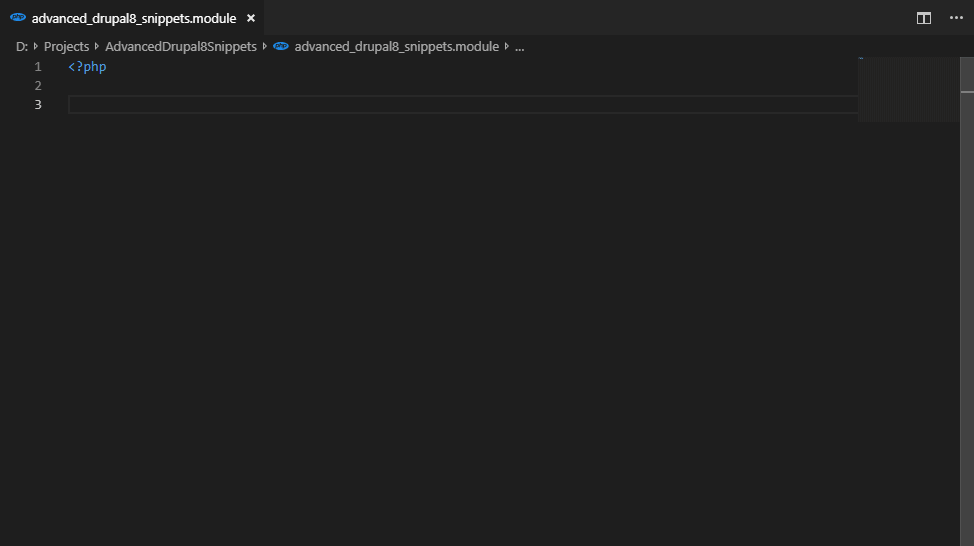

# Advanced Drupal 8 Snippets Vs Code

This extension is inspired by the [Drupal 7 Sublime Text Extension Drupal Snippets](https://packagecontrol.io/packages/Drupal%20Snippets) by [juhasz](https://github.com/juhasz) 

## Features

It provides hook snippets with typed parameters and will replace automatically hook by the filename

> The snippets have been generated by this custom python [script](https://github.com/yannick-germeau/advanced-drupal-8-snippets-vs-code-generator)

-----------------------------------------------------------------------------------------------------------
## Release Notes

### 0.0.2

Update snippets (Core 8.7.10)

### 0.0.1

Initial release of Advanced Drupal 8 Snippets (Core 8.6.9)